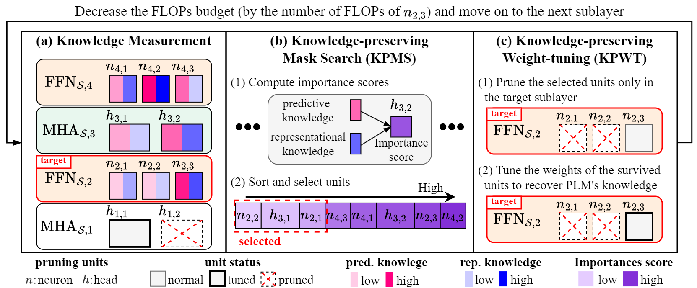

# Accurate Retraining-free Pruning for Pretrained Encoder-based Language Models
This folder contains a PyTorch implemenation of Kprune.
## Overview
### Overview of Kprune

Kprune (Knowledge-preserving pruning) is an accurate retraining-free structured pruning algorithm for transformer-based 
pre-trained language models (PLMs).
The goal of Kprune is to maximize the accuracy of the compressed model by preserving the knowledge
of the PLM through a carefully designed iterative pruning process.
The followings are the main ideas of Kprune.

**(a) Knowledge measurement.**
We measure the importance of masked units using the amount of knowledge regarding 
label prediction and intermediate representations.

**(b) Knowledge-preserving mask search (KPMS).**
We compute the importance scores of each mask, considering both predictive 
and representational knowledge.
Then, we select the masked units with the lowest importance scores for 
pruning to satisfy the FLOPs constraint.
KPMS finds the accurate pruning mask by considering the global importance of masked units.

**(c) Knowledge-preserving weight-tuning (KPWT).**
We reconstruct the distorted knowledge of the PLM after pruning 
by tuning the weights of the survived masked units.
We only prune masked units in the target sublayer to utilize efficient linear solvers.


### Code Description
This repository is written based on the codes in the [GitHub](https://github.com/WoosukKwon/retraining-free-pruning).
Here's an overview of our codes.

``` Unicode
Kprune
  │
  ├──  src    
  │     ├── dataset
  │     │    ├── glue.py: codes for loading and preprocessing GLUE benchmarks
  │     │    └── squad.py: codes for loading and preprocessing SQuAD benchmarks
  │     ├── evaluate
  │     │    ├── nlp.py: integrated codes for evaluating GLUE and SQuAD benchmarks
  │     │    ├── glue.py: codes for evaluating GLUE benchmarks
  │     │    └── squad.py: codes for evaluating SQuAD benchmarks
  │     ├── utils
  │     │    ├── arch.py: codes for utility functions related to the architecture of the model
  │     │    └── capacity.py: codes for estimating the capacity of the model, such as FLOPs     
  │     ├── main.py : codes for running Kprune 
  │     └── prune.py: codes for pruning PLMs via Kprune 
  │     
  ├──  scripts: a directory for script files
  │     └── run.sh : a script for running experiments  
  │     
  ├──  outputs: a directory for saving log files and checkpoints
  │  
  └── README.md

```

## Prerequisite
### Install dependencies
List of dependencies are as follows.
* python>=3.8
* tqdm 4.64.1
* numpy 1.23.4
* scipy 1.10.0
* scikit-learn 1.2.1
* torch 1.12.1 
* datasets 2.8.0
* transformers 4.25.1

Install dependencies using the following command
```
pip install -r requirements.txt
```

### Checkpoints of fine-tuned models
We provide checkpoints of fine-tuned BERT and DistilBERT used in our experiments.
We use pre-trained weights of BERT in [HuggingFace Transformers](https://github.com/huggingface/transformers) 
and fine-tune the model using a standard training recipe.
We use fine-tuned DistilBERT in the [GitHub](https://github.com/WoosukKwon/retraining-free-pruning).
Download our fine-tuned ckpts from the [link](https://drive.google.com/drive/folders/1G4EB76sd2Pq-aIPnUj6JTWXBEaDMLFPt?usp=sharing).

### Datasets
Our code automatically downloads the dataset for the target task when you run our main file.
You don't have to prepare the dataset manually.

## Running
### Key arguments of Kprune
* ckpt_dir: a path for the directory that contains fine-tuned checkpoints
* exp_name: the name of experiments for generating an output directory
* task_name: the name of a task to run, e.g. mrpc, qqp, sst2, stsb, mnli, qnli, squad, or squad_v2
* model_name: the name of a model to run, e.g. bert-base-uncased or distilbert-base-uncased
* gpu: the numbering of GPU to use
* seed: a random seed
* num_tokens: the number of tokens in a sample dataset
* constraint: a ratio of FLOPs to be removed
* lam_pred: a balance coefficient for predictive knowledge
* lam_rep: a balance coefficient for representational knowledge
* mu: a balance coefficient for importance scores of attention heads
* T: a temperature for softmax functions
* sublayerwise_tuning: whether perform layerwise tuning or not.
                       Remove the argument if you do not use sub-layerwise tuning.

### A code for running Kprune
The following code is an example of generating 50% compressed BERT using Kprune on MRPC.
```
GPU=0
TASK=mrpc
MODEL=bert-base-uncased
CKPT_DIR={your-path-for-fine-tuned-checkpoints}
EXP_NAME=test_run/$TASK

SAMPLE_SIZE=100000
SEED=0
CONS=0.5
LAM_PRED=1.
LAM_REP=2.5e-4
T=2
MU=64

python src/main.py --model_name $MODEL --ckpt_dir $CKPT_DIR --exp_name $EXP_NAME \
                  --task_name $TASK --gpu $GPU --seed $SEED \
                  --num_tokens $SAMPLE_SIZE --constraint $CONS \
                  --lam_pred $LAM_PRED --lam_rep $LAM_REP --mu $MU --T $T \
                  --sublayerwise_tuning
```
We provide the code for running Kprune as scripts/run.sh.
Run the script file as follows.
```
bash scripts/run.sh
```

## Reference
If you find Kprune useful or relevant to your research, please kindly cite our paper:
```
@inproceedings{park2023accurate,
  title={Accurate Retraining-free Pruning for Pretrained Encoder-based Language Models},
  author={Park, Seungcheol and Choi, Hojun and Kang, U},
  booktitle={The Twelfth International Conference on Learning Representations},
  year={2024}
}
```

## Related Projects
* HuggingFace Transformers: https://github.com/huggingface/transformers
* Kwon et al. (NeurIPS 22): https://github.com/WoosukKwon/retraining-free-pruning


